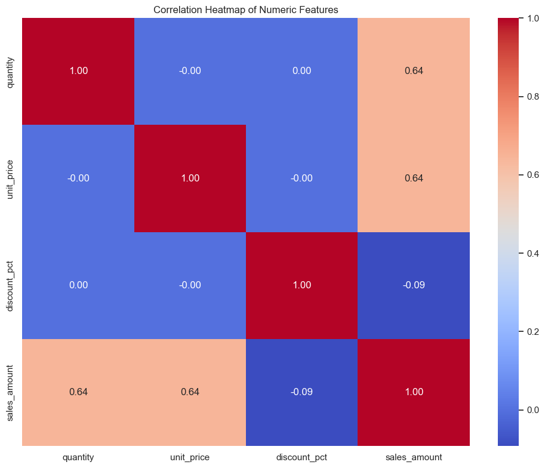
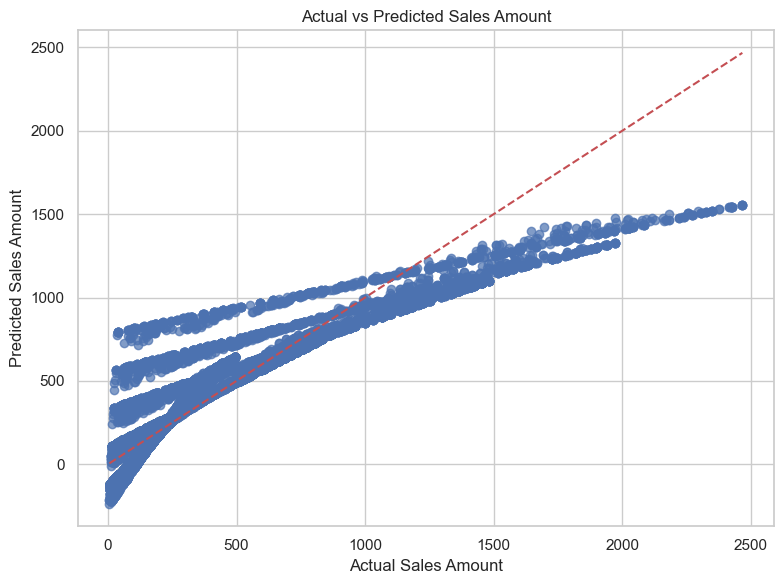
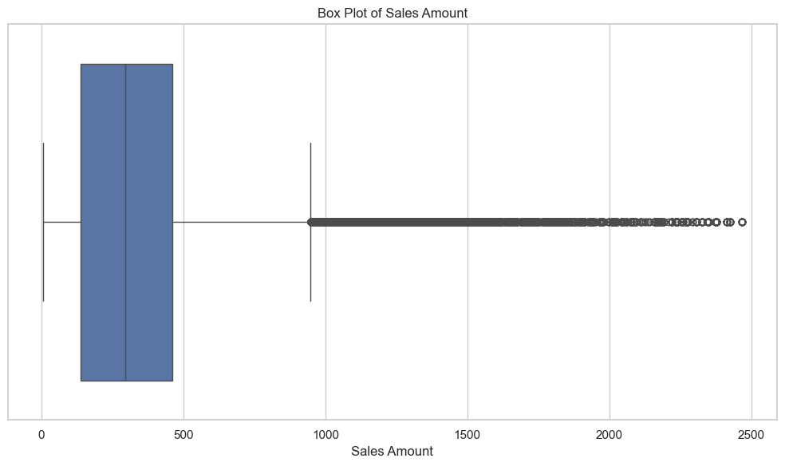
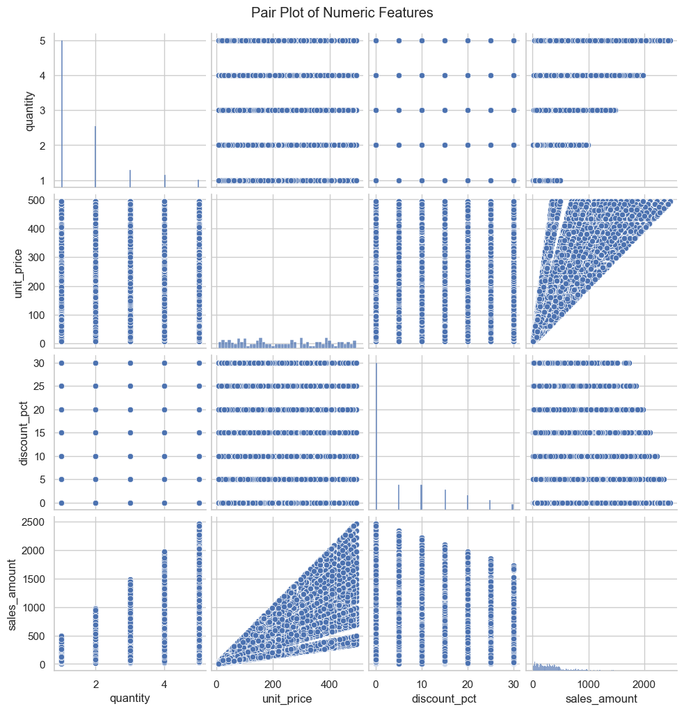

<div align="center">

# 🛒 Retail Sales Analysis & Prediction
### Python · Pandas · Scikit-learn · EDA · Machine Learning

**End-to-end data science project covering data cleaning, exploratory data analysis, customer segmentation, and sales prediction using Linear Regression — applied to 120,000 real-world retail transactions.**


[](https://www.linkedin.com/in/mutyaba-sulah-525510203/)
[](https://github.com/maka971)

</div>

---

## 📑 Table of Contents

- [📸 Analysis Preview](#-analysis-preview)
- [📌 Project Overview](#-project-overview)
- [📁 Repository Structure](#-repository-structure)
- [📊 Dataset Overview](#-dataset-overview)
- [🔍 Analysis Workflow](#-analysis-workflow)
- [💡 Key Findings](#-key-findings)
- [🤖 Machine Learning — Sales Prediction](#-machine-learning--sales-prediction)
- [🛠️ Tech Stack](#️-tech-stack)
- [🚀 How to Run](#-how-to-run)
- [📈 Skills Demonstrated](#-skills-demonstrated)
- [👨‍💻 About the Author](#-about-the-author)

---

## 📸 Analysis Preview

<div align="center">

| Correlation Heatmap | Actual vs. Predicted Sales |
|:---:|:---:|
|  |  |

| Box Plot of Sales Amount | Pair Plot of Numeric Features |
|:---:|:---:|
|  |  |

</div>

> A quick look at the core visuals from the notebook before diving into the full analysis below.

---

## 📌 Project Overview

Retail businesses generate massive volumes of transactional data every day. The challenge is extracting meaningful insight from that data to drive smarter business decisions. This project analyzes two years of retail sales data (2024–2025) to answer six key business questions:

| # | Business Question | Technique Used |
|---|---|---|
| 1 | How do sales vary over time? | Time-series aggregation, feature engineering |
| 2 | Which customer segments generate the most revenue? | GroupBy analysis |
| 3 | Which product categories drive the highest sales? | Category-level aggregation |
| 4 | Do discounts increase purchase volume? | Discount impact analysis |
| 5 | Which sales channels perform best? | Channel comparison |
| 6 | Where is demand highest geographically? | Regional analysis |

### ✨ Project Highlights

- 🧹 Cleaned and validated **120,000 transactions** across 17 columns with zero missing values
- 📊 Ran a **multi-dimensional EDA** across category, region, channel, gender, age group, and customer segment
- 🔥 Built a **correlation heatmap**, **pair plot**, and **box plot** to explore relationships and outliers in the numeric features
- 🤖 Trained a **Linear Regression** model to predict `sales_amount` and evaluated it with R²
- 💡 Converted every finding into a clear, actionable business insight

---

## 📁 Repository Structure

```
Retail-Sales-Analysis-and-Prediction/
│
├── retail_sales_dataset.xls                                    # Raw dataset (120,000 rows, 17 columns)
├── Retail Sales Analysis and Prediction_pythone_project.csv.ipynb   # Full analysis notebook
├── 
│   ├── correlation-heatmap.png
│   ├── actual-vs-predicted.png
│   ├── box-plot.png
│   └── pair-plot.png
└── README.md
```

---

## 📊 Dataset Overview

| Property | Value |
|---|---|
| Total Transactions | 120,000 |
| Time Period | Jan 2024 – Dec 2025 |
| Total Revenue | **$45,357,054** |
| Average Transaction Value | **$377.98** |
| Price Range | $5.41 – $2,467.55 |
| Features | 17 columns |

<details>
<summary><strong>📋 Full column reference (click to expand)</strong></summary>

| Column | Type | Description |
|---|---|---|
| `transaction_id` | string | Unique transaction identifier |
| `transaction_date` | date | Date of purchase |
| `customer_id` | string | Unique customer identifier |
| `customer_gender` | string | Male / Female / Other |
| `customer_age_group` | string | Age bracket (18–24, 25–34, …, 55+) |
| `customer_segment` | string | New / Returning / Loyal / VIP |
| `product_id` | string | Unique product identifier |
| `product_name` | string | Name of the product |
| `category` | string | Product category (8 categories) |
| `brand` | string | Brand name |
| `quantity` | int | Units purchased per transaction |
| `unit_price` | float | Price per unit (USD) |
| `discount_pct` | float | Discount applied (0%, 10%, 20%, 30%) |
| `sales_amount` | float | Final revenue after discount |
| `payment_method` | string | Credit Card / Debit Card / Gift Card |
| `sales_channel` | string | Online / In-Store / Mobile App |
| `region` | string | North / South / East / West / Central |

</details>

---

## 🔍 Analysis Workflow

### 1. Data Cleaning & Preprocessing
- Converted `transaction_date` from string to `datetime` format
- Verified zero null values across all 17 columns
- Engineered two new features: `transaction_month` and `transaction_weekday` to enable time-based analysis

### 2. Exploratory Data Analysis (EDA)
- Descriptive statistics, distribution plots, and correlation heatmap
- Category, region, channel, gender, age group, and segment breakdowns
- Top products and top customers by total spend
- Discount impact analysis across purchase volumes

**Correlation Heatmap**


*`quantity` and `unit_price` each correlate moderately with `sales_amount` (0.64), while `discount_pct` shows a slight negative correlation (-0.09) — confirming discounts aren't a major revenue driver.*

**Pair Plot of Numeric Features**


*Visualizing the pairwise relationships between `quantity`, `unit_price`, `discount_pct`, and `sales_amount` — the diagonal "fan" pattern in the `unit_price` vs. `sales_amount` plot reflects the multiplicative relationship between price, quantity, and discount.*

**Box Plot of Sales Amount**


*The distribution of `sales_amount` is right-skewed with a long tail of high-value transactions — expected in retail, where most purchases are low-to-mid value with occasional large basket sizes.*

### 3. Predictive Modeling
- Built a **Linear Regression** model to predict `sales_amount`
- Features used: `quantity`, `unit_price`, `discount_pct`
- Train/test split: 80% / 20%
- Evaluated using **R² score**
- Visualized Actual vs. Predicted sales amounts

---

## 💡 Key Findings

### 💰 Revenue & Transactions
- Total revenue across 2 years: **$45.36 million**
- Average transaction value: **$377.98**
- Transactions range from small grocery items ($5.41) to high-end electronics ($2,467.55)

### 🛍️ Top-Performing Categories
| Category | Total Sales |
|---|---|
| 🥇 Beauty | $6,355,718 |
| 🥈 Books | $6,005,238 |
| 🥉 Sports | $5,863,371 |
| Electronics | $5,859,687 |
| Home | $5,655,563 |
| Toys | $5,557,562 |
| Groceries | $5,431,537 |
| Clothing | $4,628,379 |

> **Insight:** Beauty leads all categories, defying the assumption that Electronics would dominate. Clothing is the weakest performer — signaling a potential need to review product assortment or pricing strategy.

### 🏆 Top 5 Products by Revenue
| Product | Total Revenue |
|---|---|
| Bread | $2,073,771 |
| Lipstick | $2,063,017 |
| Textbook | $1,737,818 |
| Smartphone | $1,631,875 |
| Water Bottle | $1,605,401 |

> **Insight:** Everyday essentials (Bread) and beauty items (Lipstick) are the top two revenue drivers — high-frequency, repeat-purchase products that sustain consistent cash flow.

### 🌍 Sales by Region
| Region | Total Sales |
|---|---|
| Central | $9,237,924 |
| West | $9,106,912 |
| North | $9,049,438 |
| South | $8,991,263 |
| East | $8,971,518 |

> **Insight:** Sales are remarkably balanced across all 5 regions (within ~3% of each other), suggesting a well-distributed customer base and consistent nationwide demand.

### 📱 Sales Channel Performance
| Channel | Total Sales |
|---|---|
| In-Store | $15,273,226 |
| Mobile App | $15,065,983 |
| Online | $15,017,845 |

> **Insight:** All three channels are nearly equal in revenue — a sign of a healthy omnichannel strategy. The Mobile App is already neck-and-neck with the traditional website, proving that mobile investment is paying off.

### 👥 Customer Segment Analysis
| Segment | Total Sales |
|---|---|
| Loyal | $11,393,721 |
| New | $11,331,907 |
| VIP | $11,320,171 |
| Returning | $11,311,255 |

> **Insight:** Revenue is nearly perfectly distributed across all four segments. Notably, **Loyal customers slightly outperform VIP customers**, suggesting the loyalty program may be more effective than premium upsells at retaining high-value buyers.

### 🎂 Age Group Breakdown
| Age Group | Total Sales |
|---|---|
| 35–44 | $9,170,231 |
| 45–54 | $9,091,969 |
| 55+ | $9,085,527 |
| 25–34 | $9,039,896 |
| 18–24 | $8,969,431 |

> **Insight:** The 35–44 age group is the top spender. The 18–24 group being the lowest is expected (lower disposable income) and represents a strong future growth opportunity with the right product targeting.

### ⚡ Discount Impact
- Discounts available: **0%, 10%, 20%, 30%**
- Average discount across all transactions: **5.5%**
- 75% of all transactions carry **no discount at all**

> **Insight:** The vast majority of sales happen at full price, proving customers are willing to pay without incentives. Discounts should be used strategically and sparingly to protect margins.

---

## 🤖 Machine Learning — Sales Prediction

### Model: Linear Regression

**Goal:** Predict `sales_amount` from transactional features

**Features used:**
- `quantity` — number of units purchased
- `unit_price` — price per unit
- `discount_pct` — discount percentage applied

**Pipeline:**
- Train / Test Split: **80% / 20%** (96,000 / 24,000 records)
- Metric: **R² Score** (coefficient of determination)
- Visual: Actual vs. Predicted scatter plot with reference diagonal line

<details>
<summary><strong>🐍 Model code (click to expand)</strong></summary>

```python
# Define the feature matrix X and target vector y for prediction
features = ['quantity', 'unit_price', 'discount_pct']
X = df[features]
y = df['sales_amount']

# Split the data into training and test sets
X_train, X_test, y_train, y_test = train_test_split(X, y, test_size=0.2, random_state=42)

# Create and train the linear regression model
model = LinearRegression()
model.fit(X_train, y_train)

# Make predictions on the test set
y_pred = model.predict(X_test)

# Calculate the R2 score as a measure of prediction accuracy
accuracy = r2_score(y_test, y_pred)
print(f"R2 Score for predicting sales_amount: {accuracy:.3f}")

# Plot the predicted vs actual sales amounts
plt.figure(figsize=(8, 6))
plt.scatter(y_test, y_pred, alpha=0.7)
plt.plot([y_test.min(), y_test.max()], [y_test.min(), y_test.max()], '--r')
plt.xlabel('Actual Sales Amount')
plt.ylabel('Predicted Sales Amount')
plt.title('Actual vs Predicted Sales Amount')
plt.tight_layout()
plt.show()
```

</details>

**Result:**


*Actual vs. Predicted sales amount, with the red dashed line representing a perfect prediction. The model captures the general upward trend but underpredicts at the high end — a sign that a purely linear model can't fully capture how `quantity`, `unit_price`, and `discount_pct` interact.*

**Why Linear Regression as a baseline?**
The core relationship `sales_amount ≈ quantity × unit_price × (1 - discount/100)` is fundamentally mathematical, making linear regression an excellent interpretable baseline before exploring more complex models.

**Proposed next steps to improve performance:**
- Add engineered features: `transaction_month`, `transaction_weekday`
- Encode categorical features (region, channel, segment) via one-hot encoding
- Try Random Forest or Gradient Boosting Regressor for non-linear interactions
- Evaluate with MAE and RMSE alongside R²

---

## 🛠️ Tech Stack

| Tool | Purpose |
|---|---|
| Python 3.x | Core language |
| pandas | Data loading, cleaning, aggregation |
| NumPy | Numerical operations |
| Matplotlib | Histograms, scatter plots, bar charts |
| Seaborn | Heatmaps, box plots, pair plots, count plots |
| scikit-learn | Linear Regression, train/test split, R² score |
| Jupyter Notebook | Interactive analysis environment |

---

## 🚀 How to Run

1. **Clone the repository**
   ```bash
   git clone https://github.com/maka971/Retail-Sales-Analysis-and-Prediction.git
   cd Retail-Sales-Analysis-and-Prediction
   ```

2. **Install dependencies**
   ```bash
   pip install pandas numpy matplotlib seaborn scikit-learn jupyter openpyxl
   ```

3. **Launch the notebook**
   ```bash
   jupyter notebook "Retail Sales Analysis and Prediction_pythone_project.csv.ipynb"
   ```

---

## 📈 Skills Demonstrated

- ✅ Real-world data cleaning and datetime type conversion
- ✅ Feature engineering from transactional data
- ✅ Multi-dimensional EDA across 7+ business dimensions
- ✅ Data visualization (histograms, box plots, heatmaps, bar charts, pair plots, scatter plots)
- ✅ Translating raw numbers into actionable business insights
- ✅ Supervised machine learning (regression modeling)
- ✅ Model evaluation and result interpretation

---

## 👨‍💻 About the Author

**Sulah Mutyaba**
Data Analyst | Power BI Developer | SQL | Python

- 📧 sulahmutyaba@gmail.com
- 💼 LinkedIn: [linkedin.com/in/mutyaba-sulah-525510203](https://www.linkedin.com/in/mutyaba-sulah-525510203/)
- 💻 GitHub: [github.com/maka971](https://github.com/maka971)

*Open to Data Analyst, BI Analyst, and related opportunities.*

---

<div align="center">

*Built as part of a data analytics portfolio. Open to feedback and collaboration.*

</div>
